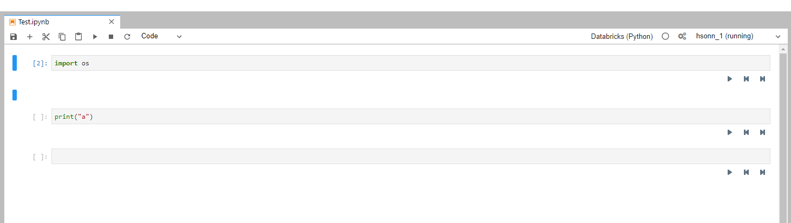
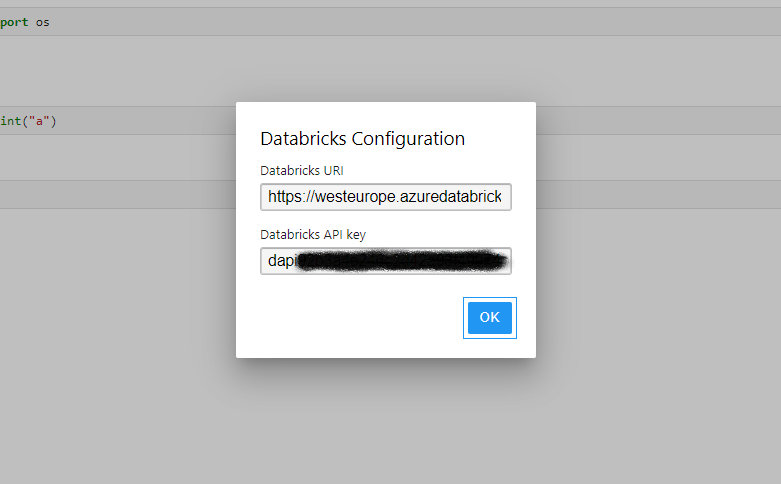
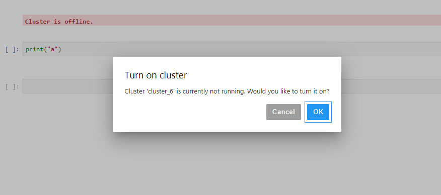
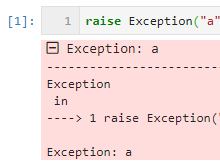
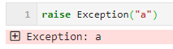
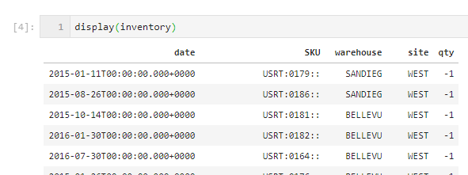

databricks_kernel
===========

``databricks_kernel`` enables to develop notebooks locally and running them on a databricks cluster.

Supports all databricks functions such as dbutils and display.

Screenshots
-----------







Installation
------------
To install ``databricks_kernel`` from PyPI::

    pip install databricks_kernel
    python -m databricks_kernel.install

Configuration
-------------
It's highly recommended to use this kernel with jupyter lab using the jupyterlab-databricks extensions. 
The extension offers configuration option and cluster switching.

Otherwise, create a new file in `~/.jupyter/databricks.json and add the following content:

```json
{
    "uri": <databrick_url>, 
    "api_key": <api_key>, 
    "cluster_id": <cluster_id>
}
```

Using the Databricks kernel
---------------------
**Notebook**: The *New* menu in the notebook should show an option for an Databricks notebook.


